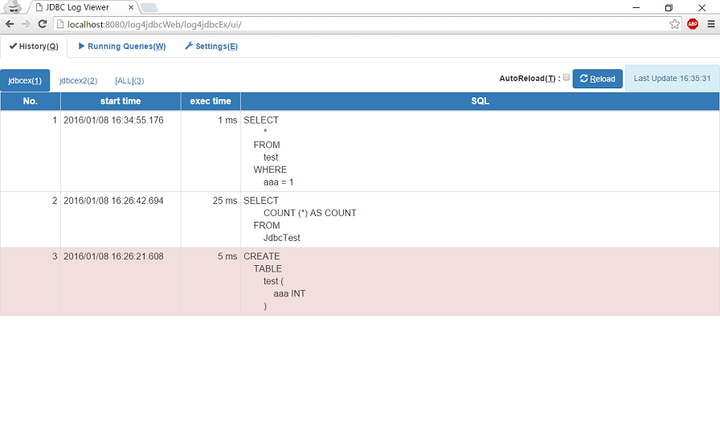

# log4jdbcEx

## 概要
実行したSQLをロギングするために、実際のJDBCドライバをラップするデバッグ用のJDBC 4.0ドライバです。  
実際のSQLはラップしたドライバにそのまま渡され、ラップしたことにより挙動が変わることはありません。

## 使い方
このロギングドライバをを利用するためには、このドライバのjarをクラスパスに含めたうえで、接続URLを変更するだけです。

　**変更前**
  　`jdbc:h2:tcp://localhost/~/test`

　**変更後**
  　`jdbc:log4jdbcex:h2:tcp://localhost/~/test`
  　jdbc:の後ろに**log4jdbcex:**を挿入する(すべて小文字であることに注意)

これだけで、ロギングが有効化されます。  
プログラム自体の修正は必要はありません。  
また、java6以降では、ドライバクラス名を明示的に指定しなくても、JVMによりJDBCドライバの初期化処理が行われるようになっているため、
ドライバクラスをロギング用のものに置き換える必要も通常ありません。(ラップ前のドライバクラス名のままでよい)  
もし、ドライバクラス名を明示的に指定する必要がある場合は、`info.bunji.jdbc.DriverEx`を指定してください。

## ログ出力設定について
ロード時にクラスパスをチェックし、以下の順序で利用するログライブラリを決定します。

1. [SLF4J](http://www.slf4j.org/)
2. [Apache Commons Logging](http://commons.apache.org/proper/commons-logging/)
3. [Apache log4j](https://logging.apache.org/log4j/1.2/)
4. [Java logging API](https://docs.oracle.com/javase/8/docs/technotes/guides/logging/)

SQLのログ自体は、ロガー名：**jdbclog**のDEBUGレベルで出力されます。

## 設定ファイルの利用について
ドライバが配置されたクラスパスのルートに**log4jdbcex.json**という設定ファイルを配置することで、
デフォルトのロギング設定を変更することが可能です。  
**__default__**で全接続共通の設定を行えるほか、JNDI名(またはconnectionURL)毎に個別に設定を
行うことができます。  
個別で指定されていない項目については、共通の設定またはデフォルト値が利用されます。

設定可能な項目は以下となります。  

* timeThreshold  
	ロギング対象とする実行時間(ms)のしきい値を指定します。  
	未指定時は、すべてのSQLを対象とします。  

* historyCount  
	UIで表示する実行履歴保持件数を指定します。  
	未指定時のデフォルトは、**50**件です。  
	※ここで設定する件数は1サーバあたりの件数となるため、複数サーバを対象とした場合は指定件数*サーバ数となります。

* acceptFilter  
	ロギング対象とするSQLを正規表現で指定します。  
	未指定およびnull指定時は、すべてのSQLがロギング対象となります。  
	指定文字はJavaのRegexに渡されるため、必要に応じてエスケープを行ってください。
	なお、パラメータのバインド後のSQLで評価されるため、特定の値が条件に指定された場合のみロギングすることも可能です。  

* ignoreFilter  
	ロギングを除外するSQLを正規表現で指定します。  
	未指定およびnull指定時は、除外処理は行われません。  
	validationQueryやアカウント情報を含むSQLなど、ログ出力不要なものを指定します。  
	このフィルタにマッチ(否定ではない)したSQLがロギング対象から除外されます。  
	指定文字はJavaのRegexに渡されるため、必要に応じてエスケープを行ってください。
	acceptFilterと同様にパラメータのバインド後のSQLで評価されます。  

* format  
	UI上でSQLを表示する際に、SQLを整形して表示するかを指定します。  
	この設定は、ログ出力には影響しません。  
	未指定時は、**true**(フォーマットする)です。  
	
* limitLength  
	ログの出力対象とするSQLの最大長を指定します。  
	最大長を超えた部分は省略して表示されます。  
	未指定時のデフォルトは、**-1**(制限なし)です。  

* connectionLogging (since:0.3.4)  
	Connectionの取得、クローズ時にログを出力します。  
	未指定時のデフォルトは、**false**(出力しない)です。  

*※SQLでエラーが発生した場合は、上記設定に関わらず、ERRORレベルでのログ出力が行われます。*

### 設定ファイル例:  

        {  
        	"_default_": {  
        		timeThreshold : 0,  
        		acceptFilter : ".*",  
        		ignoreFilter : "SELECT 1",  
        		historyCount : 30,  
        		format : true,
        		limitLength : 500,  
        		connectionLogging : false  
        	},
        	"sampleJndi":  {  
        		"timeThreshold": 1000
        	}, 
        	"jdbc:h2:tcp://localhost/~/test;SCHEMA=INFORMATION_SCHEMA": {
        		"ignoreFilter": "(?i) account_tbl "  
        	}
        }  

*※ _default_の設定は接続先を問わず、共通で利用される設定となります。*

## ログ出力の無効化について
ロガー名：**jdbclog**のログレベルを**NONE**にすることで、ログ出力が無効化されるだけでなく、
ログ出力のラップ処理を最低限にし、本来の実装を直接利用するようになります。  
これにより、開発時等はJDBC URLを変更せずに、ログレベルの変更だけで、オーバーヘッドを最小に抑えることができます。

## webapp向けのログ表示UI

webアプリケーションのJNDI接続にこのドライバを利用した場合、GUI上から実行中のクエリを
参照するための仕組みが利用可能です。  
Servlet3.0をサポートしたServetコンテナかつ、web-fragment.xmlの読込が有効な場合、自動的にUI用のマッピングが自動追加され、
利用可能となります。  
web-fragment.xmlが利用不可の場合でも、servletのマッピングを明示的に追加することで、UI機能が利用可能となります。

        <servlet>
        	<servlet-name>log4jdbcEx</servlet-name>
        	<servlet-class>info.bunji.jdbc.rest.RestApiServlet</servlet-class>
        </servlet>
        <servlet-mapping>
        	<servlet-name>log4jdbcEx</servlet-name>
        	<url-pattern>/log4jdbcEx/*</url-pattern>
        </servlet-mapping>

### アクセス例：
**http://host[:port]/contextName/log4jdbcEx/**

### 各タブの内容
* History  
	実行済みのSQLを実行時間と合わせて表示します。  

* Running Queries  
	現在実行中のSQLを経過時間と合わせて表示します。  

* Settings  
	ログの出力設定をオンラインで変更します。  
	ここでの設定はログ出力とUIの両方に影響しますが、永続化はしないため再起動時にはデフォルトの設定に戻ります。  
